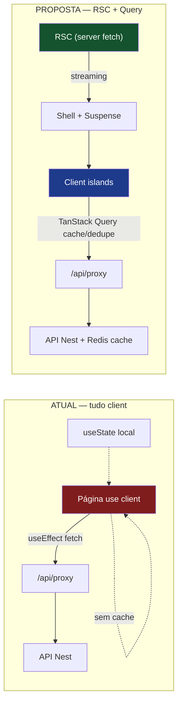
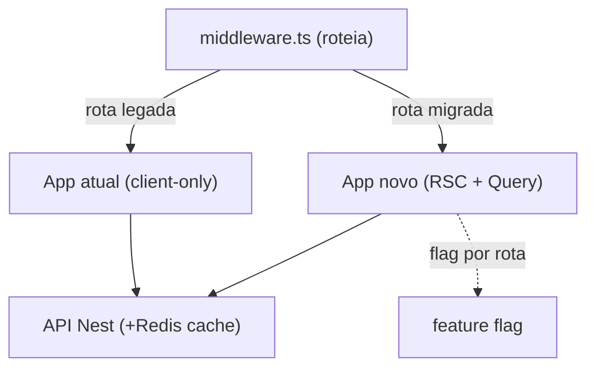

# Reimplementação do Frontend WhatsAgent — Diagnóstico + Arquitetura + Roadmap

## Status de implementação (revisado 2026-07-23 — segunda rodada de fechamento de lacunas)

Verificação item a item contra o código atual (`apps/web`, `apps/api`, `apps/ai-orchestrator`, `apps/channel-service`).

| Fase | Status | Nota |
|------|--------|------|
| F0 — Fundação | ✅ feito | Query client + `HydrationBoundary` + fetcher único + Web Vitals + Sentry (web+api) + Playwright (smoke) + **Lighthouse CI como hard gate** (`lighthouserc.json` roda contra build de produção — `next build && next start` —, thresholds `error` para performance/accessibility/best-practices, sem `continue-on-error`) + **error boundaries por rota** (`error.tsx` em cada route group) + **onError/QueryCache central** do TanStack Query (toast padronizado) + **Testing Library** instalada com 3 suítes de componente. |
| F1 — Data layer & auth | ✅ feito | `user` injetado via RSC (`layout.tsx` → `getServerUser()`), `/api/auth/me` não bloqueia mais mount (`auth-context.tsx`). Query substituiu `useApi` nas telas migradas. |
| F2 — Dashboard/Analytics | ✅ feito | `GET /analytics/dashboard` agregado + cache Redis (`cached()` em `analytics.service.ts`, TTL aplicado a KPIs/trends/funnel/heatmap/handoff-reasons). |
| F3 — Inbox real-time | ✅ feito | Mensagens em Query keyed por conversa, patch pontual via socket. `MessageBubble`, `KpiCard`, `DealCard`, `ConversationRow` memoizados. Virtualização via `@tanstack/react-virtual`. Endpoint legado sem paginação removido. |
| F4 — IA streaming | ✅ feito | Streaming de tokens via `llm.astream` → `ai.stream` → socket; `ai_typing_started/stopped`; pacing fixo removido; **métrica inbound→primeiro token** logada (`ai_first_token_latency`, `stream_context.py`). **Simulador (B6) já estava unificado** desde antes desta sessão (commit `628aa63`) — `chat-simulator.service.ts` chama `POST /internal/simulate` no orchestrator, que roda o mesmo `graph.ainvoke()` de produção (persona/tools/guard-rails/RAG), com fallback a OpenAI direto só se o orchestrator estiver fora do ar. A lacuna real que restava era `shouldHandoff`/`handoffReason` sendo descartados no caminho de volta — corrigido: agora aparecem como badge no `TestSimulator`. |
| F5 — Restante + cutover | 🟡 parcial | God-components quebrados: `settings` (907→122L), `agent/persona` (725→210L), `inbox` (580→213L), **`catalog` (441→196L)**. `dnd-kit` do CRM agora lazy via `next/dynamic` (bundle de `/crm` caiu de 24kB→5kB). Sem cutover via feature flag — decisão aceita, ver nota abaixo. |

**Bug real encontrado e corrigido nesta rodada (fora do escopo do plano, achado ao validar o build de produção):** `apps/web/src/app/(dashboard)/page.tsx` e `apps/web/src/app/page.tsx` resolviam para a mesma URL `/` (grupos de rota não mudam o path) — corrompia o client reference manifest e derrubava a landing page com 500 em `next start`. O arquivo do grupo `(dashboard)` era redundante (só fazia `redirect("/overview")`, já coberto pelo `useAuthRedirect()` da própria landing page) e foi removido. Também corrigidos: `webhook.service.ts` chamava `maybeCreateLead` em toda mensagem em vez de só na primeira (destructuring dropava `isNewContact`), e 4 testes do `ai-orchestrator` desatualizados contra assinaturas de tools que já haviam mudado.

**Itens do Quick Wins confirmados feitos:** memo em `MessageBubble`/`KpiCard`/`DealCard`/`ConversationRow`, Redis cache nos KPIs, `dynamic()` em recharts/xlsx/emoji-picker/**dnd-kit**, `next/image` em mídia do chat, polling do `agent/knowledge` condicional, virtualização de mensagens, endpoint legado removido. Polling do `overview` continua fixo em 30s via `refetchInterval` do Query (não foi trocado por push via socket — impacto baixo, mantido como está).

**Lacunas remanescentes (decisões arquiteturais em aberto, não bugs):**
1. **Cutover via feature flag (§5)** — os refactors foram aplicados in-place no app único, não atrás de flag por rota num app paralelo. Decisão aceita: o rewrite nunca virou um app separado, então o "Strangler Fig" da §5 não se aplica mais como formulado; a evolução real foi incremental no mesmo app, com testes/build validando cada mudança antes do commit.
2. **E2E além do smoke (§3.11)** — Playwright cobre só páginas públicas. O fluxo completo (login → navegação cacheada → envio de mensagem → chegada via socket → handoff) exige orquestrar postgres/redis/rabbitmq/api/channel-service/ai-orchestrator no CI — decisão de infra (docker-compose no CI? testcontainers?), não só código de teste.
3. `catalog/page.tsx` já quebrado; telas menores (orders, support, analytics) ainda não — impacto baixo, nenhuma delas está perto do tamanho que motivou o F5 originalmente.

**B6 (unificação do simulador) — corrigido de "lacuna" para "já resolvido antes desta sessão":** a rodada anterior desta auditoria (2026-07-22) listou B6 como pendente citando `chat-simulator.service.ts` chamando OpenAI direto. Isso estava desatualizado — o commit `628aa63` (anterior a toda esta sessão) já havia unificado o simulador com o orchestrator real. O erro foi não reverificar esse item específico na auditoria anterior antes de listá-lo como gap.

---

## Context

O back-office web (`apps/web`, Next.js 14 App Router) tem **navegação lenta e sensação constante de lentidão**. A investigação do código-fonte confirmou que isso **não é "culpa do React"** — é a soma de decisões arquiteturais concretas:

- **~95% da app é client-rendered** (56 de ~73 arquivos com `"use client"`); toda página renderiza `vazio → loading → dados` a cada visita porque busca dados só no `useEffect` pós-hidratação.
- **Zero cache de dados** — não há TanStack Query/SWR, nem cache de fetch do Next; `grep` por `revalidate|cache:|no-store` = 0 ocorrências. Navegar e voltar re-executa tudo. `/analytics/kpis` é buscado de forma independente por `overview` e por `analytics`.
- **Re-render em cascata no inbox** — cada mensagem de socket substitui arrays inteiros no store (`inbox.store.ts` `addMessage`), consumidores assinam a coleção inteira e **não há um único `React.memo` na app** (`grep React.memo` = 0). Uma mensagem re-renderiza a lista + todos os balões.
- **Backend amplifica a lentidão percebida** — analytics recalcula ~30 queries **sem cache** por load do overview (com KPIs de hoje computados 2×); mensagens carregam **histórico completo sem paginação**; a IA responde só ao final de um pipeline síncrono (1-3 LLMs seriais) **sem streaming**, com `setTimeout(400ms)` fixo por balão no channel-service.

**Decisão do usuário:** rewrite completo do frontend, **incluindo mudanças de backend** onde reduzem latência percebida, cobrindo as **três frentes** (dashboard, inbox, latência da IA). Este documento entrega diagnóstico com evidências, arquitetura proposta, roadmap priorizado e um **plano de migração incremental via Strangler Fig** (o rewrite roda ao lado do app atual e migra tela-a-tela — sem big-bang, produto nunca para).

**Resultado esperado:** first-paint com dados via RSC/streaming (sem tela vazia), navegação instantânea via cache, inbox que re-renderiza só o necessário com envio otimista, e IA com "digitando"/streaming — reduzindo latência percebida de segundos para ~imediato na maioria das ações.

---

## 1. Diagnóstico — evidências concretas

### 1.1 Arquitetura & rendering
| # | Problema | Evidência |
|---|----------|-----------|
| A1 | Tudo client-rendered; dados só chegam pós-hidratação | 56 arquivos `"use client"`; únicos server components são os 4 `layout.tsx` + route handlers. Todo dashboard busca em `useEffect`. |
| A2 | Sem cache de dados client nem server | TanStack Query/SWR ausentes no `package.json`; `grep revalidate\|cache:\|no-store` = 0. |
| A3 | Dois clientes HTTP divergentes | `lib/hooks/useApi.ts` (proxy BFF, cookie-aware) usado em todo lugar; `lib/api-client.ts` (`ky`, direto no backend) usado **só** em `Sidebar.tsx:50` p/ `/health`. |
| A4 | Auth checada 3×/load | `middleware.ts` (jwtVerify + refresh) → `auth-context.tsx:59` (`fetch /api/auth/me` bloqueia UI via `isLoaded`) → proxy refaz refresh no 401. |
| A5 | Polling cego | `overview/page.tsx:93` re-busca 6 endpoints a cada 30s; `agent/knowledge/page.tsx:84` a cada 3s — roda mesmo com aba em background. |

### 1.2 Estado & real-time (inbox é o ponto quente)
| # | Problema | Evidência |
|---|----------|-----------|
| S1 | Setters do store trocam coleções inteiras | `inbox.store.ts:33-36` `addMessage` reconstrói o objeto `messages` **e** mapeia todo o array `conversations` a cada evento. |
| S2 | Zero memoização de componentes | `grep React.memo\|memo(` = 0 na app inteira. `MessageBubble.tsx` (189 linhas) re-renderiza a cada evento. |
| S3 | Lista de mensagens não virtualizada | `inbox/page.tsx:434-448` `activeMessages.map(...)` renderiza todos os balões; `activeMessages` recriado a cada render (`messages[activeId] ?? []`). |
| S4 | Derivações recomputadas em render | `inbox/page.tsx:130-140,183-187` filtra `conversations` 3× por render; `avatarColor`/`getInitials` inline por item (`:286-287`). |
| S5 | Closures inline por linha de lista | `onClick={() => handleSelectConv(conv.id)}` (`:293`) etc. — nova closure por linha por render. |
| S6 | `useMemo` que nunca cacheia | `support/page.tsx:104-116` — deps são arrays recriados por `.filter` a cada render, identidade sempre muda. |
| S7 | Socket preso a páginas, não a provider | `useSocket()` chamado em `inbox/page.tsx:67` e `support/page.tsx:63`; navegar inbox↔support derruba o socket e refaz handshake. |

### 1.3 Componentes & organização
- **Componentes God-object**: `settings/page.tsx` **943 linhas**, `agent/persona/page.tsx` **738**, `catalog/page.tsx` **492**, `inbox/page.tsx` **485** (um único `InboxContent` faz socket + REST + URL params + busca + filtros + envio + UI de 2 painéis).
- **Lint de deps suprimido** em muitos efeitos (`inbox:103`, `analytics:74`, `overview:95`, `knowledge:79,86`, `support:89`).
- **Sem `next/image`** — `` cru em `MessageBubble.tsx:19,105`, `ProductCard.tsx:26` (URLs remotas sem bounds).
- **Libs pesadas eager**: `recharts` (`ConversationsChart.tsx:3-6`), `xlsx`, `framer-motion` importados estáticos; único `dynamic()` da app é o emoji-picker.

### 1.4 Backend percebido como lentidão de frontend
| # | Problema | Evidência |
|---|----------|-----------|
| B1 | Analytics recalcula tudo, sem cache | `analytics.service.ts` `getKpis` = 10 queries paralelas; `getKpiTrends:137` chama `getKpis` + `_getKpisForRange` (~20 queries) e recomputa os KPIs de hoje. Overview dispara ambos → ~30 queries/load, 2× o bloco de hoje. |
| B2 | Histórico sem paginação | `conversations.service.ts:52-72` `findMessages` = `findMany` `sentAt asc` **sem `take`/`skip`**; frontend renderiza tudo. |
| B3 | Heatmap carrega todas as mensagens da janela | `analytics.service.ts:288-307` `findMany` sobre todas as mensagens, bucketiza em JS (cresce com volume). |
| B4 | Resposta da IA 100% síncrona, sem streaming | `rabbitmq.py:181-215` só publica após `graph.ainvoke` completo; `nodes.py` faz 1-3 `llm.ainvoke` seriais (reasoning → tools → segundo LLM → guard-rail rewrite). |
| B5 | Pacing artificial na entrega | `outbound.consumer.ts:69` `setTimeout(400ms)` **fixo entre cada balão** — resposta de 3 balões = +800ms de espera pura. |
| B6 | Simulador diverge da produção | `chat-simulator.service.ts` chama OpenAI direto (sem guard-rails/tools/RAG/memória); "digitando" do `TestSimulator.tsx:102-119` é fake. |

### 1.5 IA no atendimento — separação de responsabilidades
- **Bom**: toda lógica de IA vive no orchestrator (LangGraph). As telas `agent/*` são **puros formulários de config** (persona/rules/knowledge → `PATCH /agent/config`); nenhuma chamada de LLM no frontend.
- **Ruim para UX conversacional**: inbox mostra **só mensagens finais** (sem streaming, sem "IA digitando", sem optimistic send — `handleSend:161-181` só mostra o balão quando o servidor ecoa via socket). Memória do agente é curta (Redis, últimas 12 turnos em `nodes.py:127`) mas isso é adequado; o problema é **latência percebida**, não a memória.
- **Duplicação**: `chat-simulator.service.ts` reimplementa montagem de prompt no serviço `api`, criando um "segundo agente" que não bate com produção.

---

## 2. Lista priorizada de problemas (impacto × esforço)

| Prio | Problema | Impacto | Esforço | Causa raiz |
|------|----------|---------|---------|-----------|
| P0 | Sem cache de dados (A2) | 🔴 Alto | Baixo | falta data layer |
| P0 | Analytics ~30 queries/load sem cache (B1) | 🔴 Alto | Médio | backend |
| P0 | Re-render total do inbox por mensagem (S1,S2) | 🔴 Alto | Médio | store + zero memo |
| P0 | Tudo client-rendered, tela vazia no load (A1) | 🔴 Alto | Alto | sem RSC |
| P1 | Sem virtualização de mensagens (S3) | 🟠 Médio | Baixo | — |
| P1 | Sem optimistic UI no envio (frontend + B4) | 🟠 Médio | Baixo | — |
| P1 | IA sem streaming/"digitando" (B4,B5) | 🟠 Médio | Alto | backend pipeline |
| P1 | Auth checada 3×/load (A4) | 🟠 Médio | Baixo | — |
| P2 | Polling cego 30s/3s (A5) | 🟡 Baixo | Baixo | — |
| P2 | God-components / lint suprimido (1.3) | 🟡 Baixo | Alto | dívida técnica |
| P2 | `` cru, libs eager (1.3) | 🟡 Baixo | Baixo | — |
| P2 | Simulador diverge (B6) | 🟡 Baixo | Médio | duplicação |

---

## 3. Arquitetura proposta

**Stack recomendada (rewrite):** manter **Next.js 15 App Router** como base do rewrite — não migrar para Vite SPA. Justificativa: (1) o padrão BFF/proxy + cookies httpOnly já é seguro e maduro e é uma força do Next; (2) RSC elimina a causa raiz "tudo client-rendered" — dados de dashboard buscados no servidor e transmitidos via streaming; (3) Suspense + streaming SSR dão first-paint com dados sem tela vazia; (4) code-splitting por rota de graça. **Trade-off:** Vite SPA teria HMR mais rápido em dev, mas jogaria fora o BFF/middleware e não resolve o first-paint vazio (continua client-only). Para um back-office autenticado com muito real-time, RSC (dashboard) + TanStack Query (telas real-time) é o melhor dos dois mundos.

### Arquitetura atual vs proposta



### 3.1 Organização de diretórios (feature-first)
```
apps/web/src/
  app/                      # rotas finas: RSC busca dados, delega a features
    (dashboard)/inbox/page.tsx        # RSC: prefetch + <InboxView/>
  features/                 # 1 pasta por domínio (a nova unidade)
    inbox/{api,components,hooks,store,types}
    analytics/{api,components,hooks}
    agent/  crm/  catalog/  orders/  settings/
  shared/
    api/         # query-client, fetcher, tipos de erro
    ui/          # design system (Button, Card, Skeleton, ...)
    hooks/  lib/  realtime/   # SocketProvider global
  server/        # server-only: cookies, auth, proxy helpers
```
Regra: `app/*` fica fino (server component que faz prefetch e monta a feature); lógica vive em `features/<dominio>`. Quebra os god-components (settings 943, inbox 485) em subcomponentes memoizados por seção.

### 3.2 Estratégia de componentes
- **Server Components por padrão**; `"use client"` só em ilhas interativas (formulários, chat, charts).
- Componentes de lista **sempre `React.memo`** com props estáveis (ex.: `MessageBubble`, `ConversationRow`, `KpiCard`, `DealCard`) — hoje há **0** memos.
- Handlers via `useCallback`; nada de closure inline em `.map` de listas grandes.
- Modais/charts pesados via `next/dynamic` (recharts, xlsx, emoji-picker, dnd-kit).

### 3.3 Gerenciamento de estado (separar server-state de client-state)
- **Server-state → TanStack Query** (cache, dedupe, revalidação, `staleTime`). Substitui todo o padrão `useEffect + useState + apiFetch`.
- **Client-state (UI) → Zustand** só para o que é genuinamente local/efêmero: aba ativa, sidebar, rascunho de mensagem. O inbox deixa de manter cópia durável no store.
- **Correção do inbox**: mensagens viram cache do Query keyed por `["messages", convId]`; socket faz `queryClient.setQueryData` **daquela** conversa — não toca as outras. Fim do re-render global.

```ts
// features/inbox/hooks/useMessages.ts
export function useMessages(convId: string) {
  return useQuery({
    queryKey: ["messages", convId],
    queryFn: () => api.get(`/conversations/${convId}/messages`),
    staleTime: 30_000,
  });
}
// realtime: atualiza SÓ a conversa afetada (não a coleção inteira)
socket.on("new_message", (m) => {
  qc.setQueryData(["messages", m.conversationId], (old = []) => [...old, m]);
  qc.setQueryData(["conversations"], patchLastMessage(m)); // patch pontual
});
```

### 3.4 Comunicação com APIs
- **Fetcher único** (fim dos 2 clientes): wrapper sobre `fetch`/`ky` que sempre vai ao proxy BFF, com tipos de erro normalizados e retry de refresh centralizado. Elimina `lib/api-client.ts` direto no backend.
- **RSC prefetch + hydration**: server component faz `queryClient.prefetchQuery` e passa via `<HydrationBoundary>` → tela já vem com dados, e o client reusa o cache (sem refetch no mount).
- **Batch server-side** para o overview: 1 endpoint agregado `/analytics/dashboard` em vez de 6 chamadas.

### 3.5 Cache (3 camadas)
1. **Server (RSC/Next)**: `fetch` com `next: { revalidate }` para dados semi-estáticos (config do tenant, catálogo).
2. **Client (TanStack Query)**: `staleTime` por domínio; navegação instantânea (dados do cache) + revalidação em background.
3. **Backend (Redis)**: cache dos KPIs de analytics (TTL 30-60s) — resolve B1 na raiz. Chave `analytics:{tenantId}:{range}`.

### 3.6 Autenticação (simplificar de 3 checagens para 1)
- **Middleware** continua sendo a fonte da verdade (jwtVerify + refresh). 
- **Remover a 2ª checagem bloqueante**: `auth-context` para de dar `fetch /api/auth/me` no mount que trava `isLoaded`. O `user` inicial vem do **RSC** (server lê o cookie, injeta no layout) → UI não espera round-trip client.
- Socket-ticket handshake permanece (é bom).

### 3.7 Tratamento de erros
- **Error Boundaries por rota** (`app/**/error.tsx`) + boundary global.
- TanStack Query com `onError` central → toasts padronizados; estados `isError` com retry por tela.
- Fetcher normaliza erros (401/403/5xx) em tipos discrimináveis.

### 3.8 Loading & feedback visual (matar a sensação de lentidão)
- **Streaming SSR + `loading.tsx`/Suspense** por rota → skeletons instantâneos, sem tela branca.
- **Skeletons específicos** por tela (KPI grid, lista de conversas) em vez de spinner global.
- **Optimistic UI**: envio de mensagem, mover deal no CRM, toggles de config aparecem na hora (rollback em erro). Hoje o envio espera o echo do socket.
- `nextjs-toploader` já existe — manter.

### 3.9 Otimização de performance (frontend)
- RSC/streaming (A1), memoização de listas (S2), virtualização de mensagens com `@tanstack/react-virtual` (S3), `next/dynamic` para libs pesadas, `next/image` para mídia, `experimental.optimizePackageImports` para `lucide-react`/`recharts`.
- Polling cego → **revalidação por visibilidade** (`refetchOnWindowFocus`) ou push via socket, nunca `setInterval` fixo com aba oculta.

### 3.10 IA no atendimento — reduzir latência percebida
Ordem de ataque (frontend barato → backend estrutural):
1. **"IA digitando"** (frontend): ao receber `msg.inbound` a API emite `ai_typing_started`; inbox mostra os três pontinhos reais. Baixo esforço, alto ganho percebido.
2. **Remover pacing fixo** (B5): trocar `setTimeout(400ms)` por delay proporcional/curto ou emitir o balão para o socket **antes** do rate-limit da Meta (o cliente do WhatsApp e o inbox não precisam do mesmo pacing).
3. **Streaming de tokens** (B4, longo prazo): orchestrator usa `graph.astream`/callbacks para emitir tokens parciais num tópico `ai.stream`; API repassa via socket; inbox renderiza incremental. Maior esforço, transforma a percepção.
4. **Unificar o simulador** (B6): `TestSimulator` chama o orchestrator real (com guard-rails/tools/RAG) — fim do "segundo agente".

### 3.11 Testes
- **Unit** (Vitest): stores, hooks de Query (mock fetch), utils (`persona.ts` já tem teste).
- **Componentes** (Testing Library): inbox render/optimistic, formulários de agent.
- **E2E** (Playwright): login BFF, navegação com cache, envio de mensagem + chegada via socket, handoff.
- **Regressão de perf**: Lighthouse CI no pipeline + budget de bundle.

### 3.12 Monitoramento
- **Web Vitals** (LCP/INP/CLS) → `useReportWebVitals` para um endpoint/Sentry.
- **Sentry** (frontend + `api`): erros + traces de latência de endpoint (mede B1 real).
- **Métrica de latência da IA** ponta-a-ponta (inbound → primeiro token) para validar §3.10.

### 3.13 Deploy
- Rewrite atrás de **feature flag / rota** (Strangler, §5). Build por app (Turborepo já isola). Preview deploys por PR. Lighthouse CI como gate. Cutover por rota, com rollback trivial (flag).

---

## 4. Roadmap de implementação (Strangler Fig, sem big-bang)

O novo app é construído no mesmo `apps/web` (ou `apps/web-next` rodando em paralelo atrás do middleware), migrando **rota por rota**. Cada fase entrega valor sozinha.

| Fase | Entrega | Complexidade | Risco | Ganho esperado |
|------|---------|--------------|-------|----------------|
| **F0 — Fundação** | Query client + `HydrationBoundary`, fetcher único, design-system base (Skeleton/ErrorBoundary), Sentry + Web Vitals, Playwright/Lighthouse CI. Define `features/`. | Média | Baixo | Base p/ tudo; mede baseline |
| **F1 — Data layer & auth** | RSC shell + `loading.tsx` por rota; `user` via RSC (remove `/me` bloqueante); TanStack Query substitui `useApi` nas telas simples. | Média | Médio | First-paint com skeleton; -1 round-trip auth |
| **F2 — Dashboard/Analytics** | `/analytics/dashboard` agregado + **Redis cache** (B1); overview/analytics em RSC + Query; fim do polling 30s. | Média | Médio | Navegação instantânea; ~30→~2 queries/load |
| **F3 — Inbox real-time** | Migrar server-state p/ Query keyed por conversa (S1); `React.memo` + virtualização (S2/S3); optimistic send; **SocketProvider global** (S7); paginação de mensagens (B2). | Alta | Médio | 1 msg = re-render pontual; envio instantâneo |
| **F4 — IA streaming** | `ai_typing` indicator; remover pacing 400ms (B5); streaming de tokens (B4); unificar simulador (B6). | Alta | Alto | Latência percebida da IA cai drasticamente |
| **F5 — Restante + cutover** | Migrar catalog/crm/orders/settings/agent (quebrar god-components); `next/image`; `dynamic()` libs pesadas; remover código legado; flip final da flag. | Alta | Baixo | Consistência, bundle menor, manutenção |

**Dependências:** F1 depende de F0; F2/F3 dependem de F1 (data layer); F4 depende de F3 (inbox pronto p/ receber streaming); F5 é contínua e fecha o Strangler.

### Quick Wins (aplicáveis JÁ no app atual, enquanto o rewrite anda — baixo esforço, alto impacto)
1. `React.memo` em `MessageBubble` + `useCallback` nos handlers → corta grande parte do re-render do inbox. (S2)
2. Redis cache nos KPIs de analytics (TTL 30-60s) → resolve B1 sem tocar frontend. (B1)
3. Optimistic append no `handleSend` do inbox → envio "instantâneo". (frontend)
4. Trocar polling 30s do overview por `refetchOnWindowFocus`/visibility → para de queimar CPU/rede em aba oculta. (A5)
5. `dynamic()` no recharts + `next/image` na mídia do chat → bundle inicial menor. (1.3)

### Médio prazo (estrutural)
Data layer TanStack Query, RSC no dashboard, virtualização, paginação de mensagens, agregado de analytics, "IA digitando".

### Longo prazo (arquitetural)
Streaming de tokens da IA ponta-a-ponta, quebra dos god-components, unificação do simulador com o orchestrator, monitoramento de Web Vitals/latência como gate de CI.

---

## 5. Plano de migração incremental (Strangler Fig)



1. Sobe a fundação (F0) **sem** trocar telas — só infra (Query provider, fetcher, Sentry).
2. Migra 1 rota simples primeiro (ex.: `settings` ou `overview`) como piloto do padrão RSC+Query.
3. Cada rota migrada fica atrás de flag; rollback = desligar flag (volta à versão legada).
4. Backend (Redis cache, paginação, streaming) evolui em paralelo — **compatível com ambos** os frontends.
5. Cutover final quando todas as rotas estiverem migradas; remove o código legado (F5).

---

## 6. Comparação atual vs proposta

| Dimensão | Atual | Proposta |
|----------|-------|----------|
| Rendering | 100% client, tela vazia no load | RSC + streaming, first-paint com dados/skeleton |
| Cache dados | Nenhum | Query (client) + Redis (server) + Next fetch |
| Estado | Zustand guarda server-state (churn) | Query = server-state; Zustand = só UI |
| Re-render inbox | Lista inteira + todos os balões por msg | Só a conversa/balão afetado (memo + virtualização) |
| Envio de msg | Espera echo do socket | Optimistic (instantâneo) |
| Analytics | ~30 queries/load, sem cache | Agregado + Redis (~2 queries) |
| Auth no load | 3 checagens (2 bloqueiam) | 1 (middleware) + user via RSC |
| IA UX | Só msg final, sem streaming | "Digitando" + streaming de tokens |
| Libs | recharts/xlsx eager | `dynamic()` + `optimizePackageImports` |
| Observabilidade | Nenhuma | Web Vitals + Sentry + Lighthouse CI |

---

## 7. Verificação (como testar ponta-a-ponta)

- **Baseline antes/depois**: rodar Lighthouse (`overview`, `inbox`, `analytics`) e registrar LCP/INP/TBT + nº de queries no `/analytics/*` (log do Prisma) — comparar por fase.
- **Cache de navegação**: navegar `overview → inbox → overview`; confirmar que a 2ª visita não refaz fetch (DevTools Network vazio / React Query DevTools "fresh").
- **Re-render do inbox**: com React DevTools Profiler, enviar 1 mensagem via socket e confirmar que só o `MessageBubble` novo + a `ConversationRow` afetada renderizam (não a lista inteira).
- **Optimistic send**: enviar mensagem com rede lenta (throttle) — o balão aparece imediatamente e concilia com o echo do socket.
- **Analytics backend**: `pnpm --filter @whatsagent/api dev`, hit em `/analytics/dashboard` 2× e confirmar 2ª resposta do Redis (log/latência); validar contagem de queries caiu.
- **IA "digitando"/streaming**: enviar mensagem de teste no fluxo Meta (ou simulador unificado) e confirmar indicador de digitação + (F4) tokens incrementais no inbox.
- **Testes automatizados**: `pnpm test` (unit/componente) + Playwright E2E (login → navegação cacheada → envio → chegada via socket → handoff) verdes antes de cada cutover de rota.
